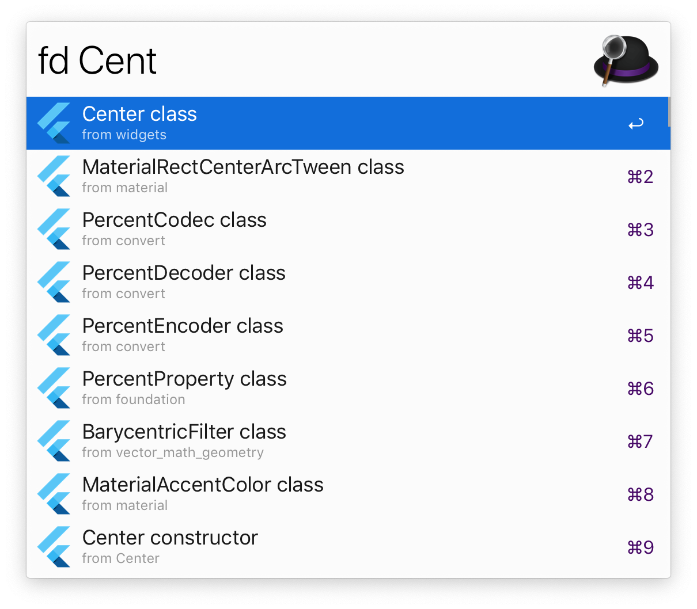

# alfred-flutter-docs

> [Alfred 3](https://www.alfredapp.com) workflow to search [Flutter Docs](https://docs.flutter.io/)

[](alfred-flutter-docs)
[](alfred-flutter-docs)

Flutter allows you to build beautiful native apps on iOS and Android from a single codebase.




## Install

```
$ npm install --global alfred-flutter-docs
```

Or

Directly download `alfred-flutter-docs.alfredworkflow` from the [Releases](https://github.com/Sh1d0w/alfred-flutter-docs/releases) page.

*Requires [Node.js](https://nodejs.org) 8+ and the Alfred [Powerpack](https://www.alfredapp.com/powerpack/).*

## Usage

In Alfred, type `fd`, <kbd>Enter</kbd>, and your query, to search.

Select a row and press <kbd>Enter</kbd> to go to its documentation page.<br>
Hold <kbd>Command</kbd> to display additional information.<br>
Press <kbd>Shift</kbd> to view its documentation in Quick Look.

## License

MIT © [Radoslav Vitanov](https://github.com/Sh1d0w)
